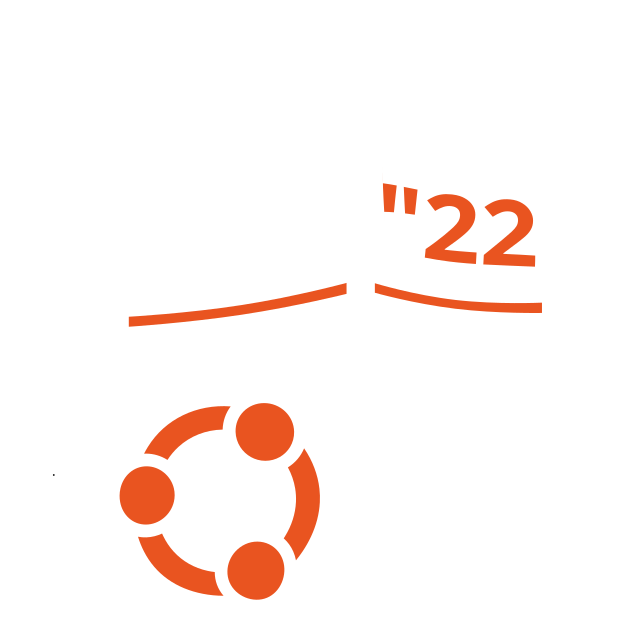
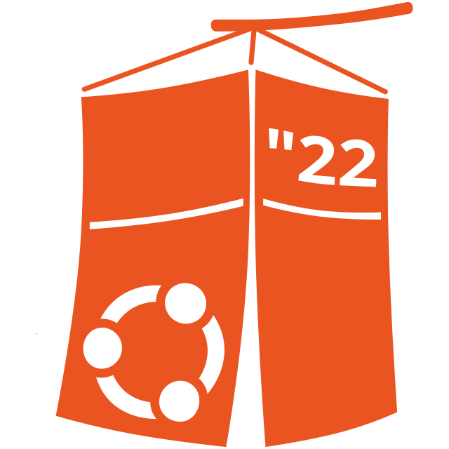
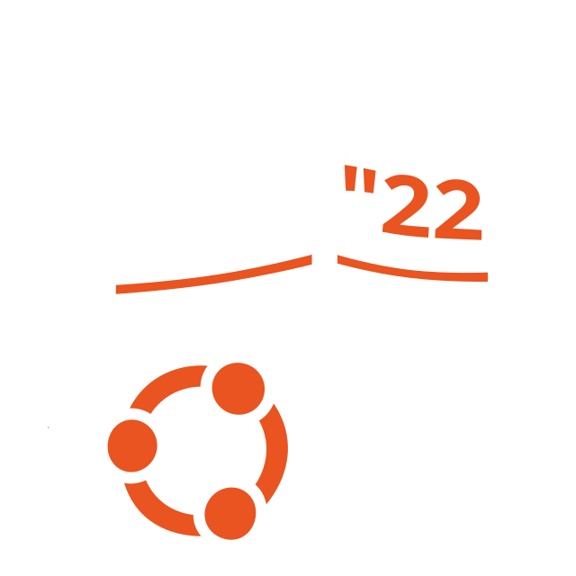
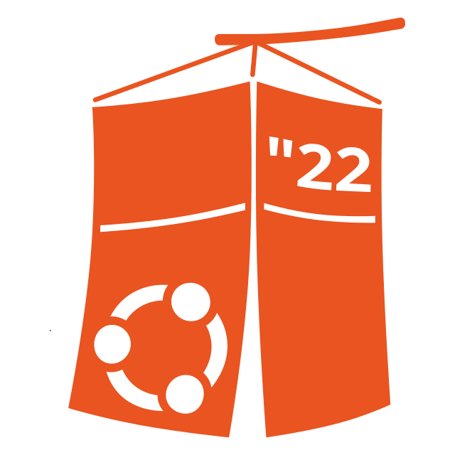
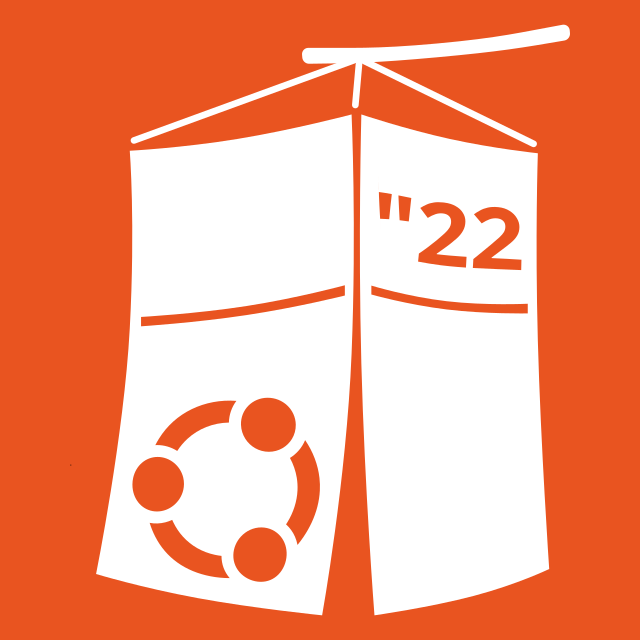

# UbuCon Asia 2022 Logo and other artworks
UbuCon Asia 2022 logo was designed with inspiration from [Cheongsachorong](https://en.wikipedia.org/wiki/Cheongsachorong), which is a traditional Korean lantern.

## Logo

### SVG 640px * 640px
| Orange | White |
|---|---|
|||

### PNG 640px * 640px
| Orange | White |
|---|---|
|||

## Logo with padding and background

### SVG 640px * 640px
| Orange | White |
|---|---|
|||

### PNG 640px * 640px
| Orange with white background | White with orange background |
|---|---|
|||